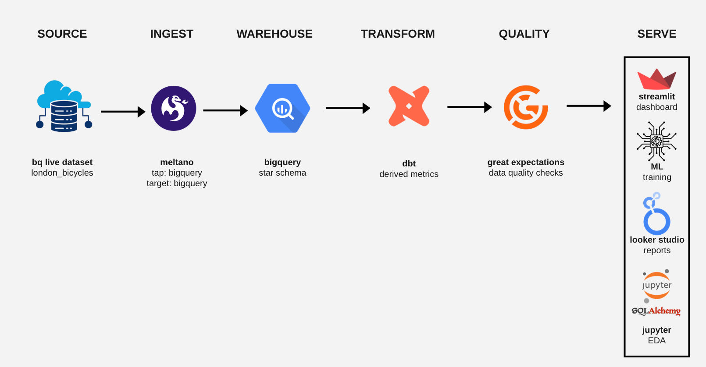
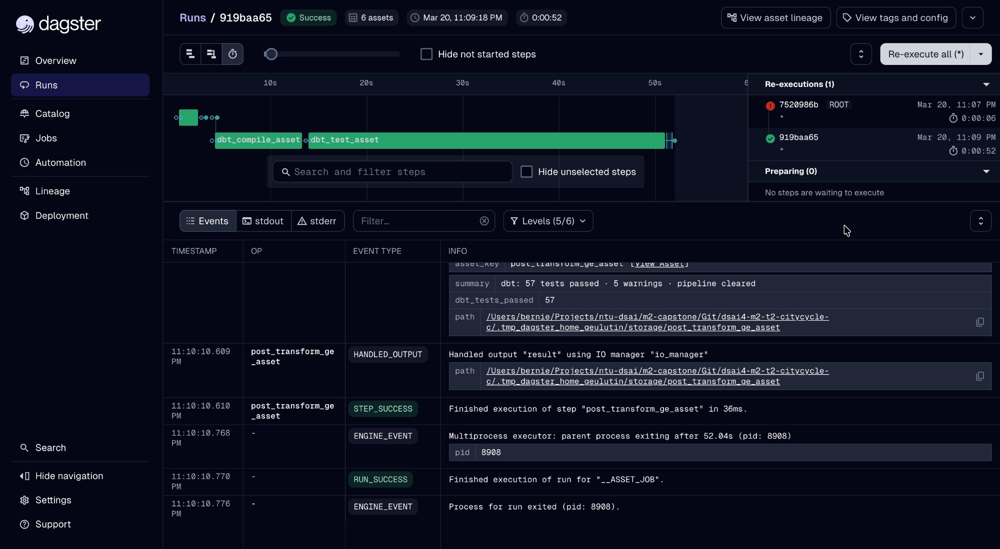

# 🚲 CityCycle London — Bike Rebalancing Intelligence Pipeline

> **dsai4-m2-t2-citycycle**  
> End-to-end ELT pipeline for the London Bicycle Sharing dataset, built for the CityCycle operations team to solve the bike rebalancing problem using data engineering, ML forecasting, and interactive dashboards.

---

## Table of Contents TEST

1. [Business Problem](#business-problem)
2. [Solution Overview](#solution-overview)
3. [Architecture](#architecture)
4. [Tech Stack](#tech-stack)
5. [Repository Structure](#repository-structure)
6. [Getting Started](#getting-started)
7. [Mock Data Strategy (Free Tier Protection)](#mock-data-strategy)
8. [Pipeline Walkthrough](#pipeline-walkthrough)
   - [1. Ingestion (Meltano)](#1-ingestion-meltano)
   - [2. Data Warehouse Design (BigQuery Star Schema)](#2-data-warehouse-design)
   - [3. ELT Transformation (dbt)](#3-elt-transformation-dbt)
   - [4. Data Quality (Great Expectations)](#4-data-quality-great-expectations)
   - [5. Analysis & ML (Python / scikit-learn)](#5-analysis--ml)
   - [6. Orchestration (GitHub Actions CI)](#6-orchestration-github-actions-ci)
   - [7. Dashboards (Streamlit + Looker Studio)](#7-dashboards)
9. [Key Findings (Live Data)](#key-findings-live-data)
10. [Risks & Mitigations](#risks--mitigations)
11. [Contributing](#contributing)

---

## Business Problem

London's CityCycle bike-sharing network operates **795 active docking stations** across the city, processing millions of rides annually. The core operational challenge is **bike rebalancing**: stations run empty (stranded demand) or overflow (no docks to return), leading to:

- **Lost revenue** from unfulfilled rentals
- **Increased operational costs** for manual rebalancing crews
- **Poor customer experience** and negative NPS
- **Inefficient fleet utilisation** across the network

**Goal:** Build an intelligent, data-driven pipeline that ingests ride history, detects imbalance patterns, forecasts demand per station, and visualises actionable rebalancing recommendations in near real-time.

---

## Solution Overview

```
BigQuery Public Data → Meltano Ingest → BQ Raw → dbt Transform
→ Great Expectations Quality Gate → ML Demand Forecast
→ Streamlit Dashboard + Looker Studio Report
(CI/CD orchestrated by GitHub Actions · 5 jobs · push-triggered)
```

---

## Architecture



The pipeline follows a **medallion-style** architecture:

- **Bronze** (`raw.*`): Raw tables ingested from BigQuery public dataset via Meltano
- **Silver** (`staging.*`): Cleaned, typed, validated tables via dbt staging models
- **Gold** (`marts.*`): Star schema fact/dimension tables for analytics and ML

---

## Tech Stack

| Layer        | Tool                                         | Purpose                                    |
| ------------ | -------------------------------------------- | ------------------------------------------ |
| Ingestion    | **Meltano** (tap-bigquery → target-bigquery) | Singer-protocol EL from source to raw      |
| Warehouse    | **Google BigQuery**                          | Cloud data warehouse, star schema          |
| Transform    | **dbt Core**                                 | SQL-based ELT, lineage, testing            |
| Quality      | **Great Expectations**                       | Expectation suites, checkpoints, data docs |
| Analysis     | **Python / pandas / scikit-learn**           | EDA, feature engineering, ML               |
| Dashboard    | **Streamlit**                                | Interactive ops dashboard + geospatial map |
| BI Reporting | **Looker Studio**                            | Executive KPI report (BQ connector)        |

---

## Repository Structure

```
dsai4-m2-t2-citycycle/
├── .github/
│   └── workflows/
│       └── ci.yml                    # GitHub Actions: lint, mock-data, dbt-compile, train-model, notebook
├── ingestion/
│   ├── meltano.yml                   # Meltano project config (tap-bigquery → target-bigquery)
│   ├── load_mock.py                  # Python loader: mock CSV → BigQuery (dry-run + live)
│   ├── load_live_stations.py         # One-time loader: stations from BQ public dataset
│   └── bq_cost_guard.py              # Query cost guard: dry-run estimates + monthly budget tracking
├── transform/
│   ├── dbt_project.yml               # dbt project config
│   ├── profiles_template.yml         # profiles.yml template (DO NOT commit real profiles.yml)
│   ├── models/
│   │   ├── staging/
│   │   │   ├── stg_cycle_hire.sql    # Clean + type raw ride data
│   │   │   ├── stg_cycle_stations.sql # Clean stations, add zone + capacity_tier
│   │   │   └── _staging.yml          # 25 schema tests
│   │   ├── intermediate/
│   │   │   ├── int_rides_enriched.sql        # Join rides + stations, add flags
│   │   │   └── int_station_daily_stats.sql   # Daily imbalance per station
│   │   └── marts/
│   │       ├── dim_stations.sql      # Station dimension with rebalancing priority
│   │       ├── dim_date.sql          # Date spine 2015–2025
│   │       ├── fact_rides.sql        # 32.3M rows, partitioned by hire_date
│   │       └── _marts.yml            # 31 schema tests (56 PASS · 0 ERROR · 3 WARN in last run)
│   ├── macros/
│   │   └── generate_surrogate_key.sql
│   └── tests/
│       └── assert_ride_duration_positive.sql
├── quality/
│   ├── checkpoints/
│   │   └── post_ingest.yml           # GE checkpoint config
│   ├── expectations/
│   │   └── suites/
│   │       ├── raw_cycle_hire.json
│   │       └── fact_rides.json
│   ├── run_ge_checks.py              # 34 custom SQL checks: 30 PASS · 4 WARN · 0 FAIL
│   └── ge_results.json               # Last run results (evidence)
├── orchestration/
│   ├── workspace.yaml                # Dagster scaffold (reference only — CI uses GitHub Actions)
│   ├── assets/
│   │   ├── ingestion_assets.py
│   │   ├── transform_assets.py
│   │   └── quality_assets.py
│   └── jobs/
│       └── citycycle_pipeline_job.py
├── analysis/
│   └── notebooks/
│       ├── 01_eda_mock_data.ipynb           # Initial EDA on mock data
│       └── 03_bq_eda_live_data.ipynb        # Live BQ EDA via SQLAlchemy (32M rows)
├── ml/
│   └── models/
│       └── train_demand_model.py     # 3-model comparison: Linear Reg · Random Forest · XGBoost
├── dashboard/
│   ├── app.py                        # Streamlit entry point
│   ├── pages/
│   │   ├── 01_overview.py            # KPIs + daily trend + hourly demand
│   │   ├── 02_station_map.py         # pydeck 3D + folium detailed map
│   │   ├── 03_rebalancing.py         # Intervention list + crew runs estimate
│   │   ├── 04_forecast.py            # 24h XGBoost demand forecast
│   │   └── 05_scenario.py            # Guided scenario planner — corridor + dispatch
│   └── utils/
│       ├── bq_client.py              # BQ connection via cost guard
│       └── mock_data_generator.py    # Synthetic data generator (CI-safe)
├── data/
│   └── mock/
│       ├── cycle_hire_mock.csv       # 10K synthetic rides (CI + dev)
│       └── cycle_stations_mock.csv   # 795 station records
├── docs/
│   └── diagrams/
│       └── dataflow_diagram.png      # Architecture diagram
├── .env.example                      # Template for env vars (no secrets)
├── .gitignore
├── requirements.txt
└── README.md
```

---

## Getting Started

### Prerequisites

- Python 3.10+
- Google Cloud account with BigQuery access
- `gcloud` CLI authenticated
- Node.js 18+ (for pptxgenjs, optional)

### 1. Clone & Install

```bash
git clone https://github.com/YOUR_ORG/dsai4-m2-t2-citycycle.git
cd dsai4-m2-t2-citycycle

python -m venv .venv && source .venv/bin/activate
pip install -r requirements.txt
```

### 2. Configure Environment

```bash
cp .env.example .env
# Edit .env — add your GCP project ID, BQ dataset names, etc.
# NEVER commit .env to Git
```

### 3. Run with Mock Data First (Recommended)

Before touching BigQuery's live data, validate the full pipeline with local mock data:

```bash
# Generate mock data
python dashboard/utils/mock_data_generator.py

# Load mock CSV into BigQuery (raw schema)
python ingestion/load_mock.py --mode=mock

# Run dbt transformations
cd transform && dbt run --target dev

# Run quality checks
python quality/run_ge_checks.py

# Launch dashboard
streamlit run dashboard/app.py
```

### 4. Run Full Pipeline (Real Data)

Once validated on mock data, switch to live ingestion:

```bash
# Meltano ingest from BQ public dataset
cd ingestion && meltano run tap-bigquery target-bigquery

# Then continue with dbt + GE as above

# See .github/workflows/ci.yml for the full CI pipeline
```

---

## Mock Data Strategy

### Why Mock Data First?

BigQuery's free tier provides **1 TB of query processing per month**. The `cycle_hire` table has **83 million rows**. A single unguarded `SELECT *` could consume the entire monthly quota instantly.

### Our Approach

| Risk                            | Mitigation                                                     |
| ------------------------------- | -------------------------------------------------------------- |
| Full-table scan on `cycle_hire` | `LIMIT` clauses on all dev queries; partitioned by `hire_date` |
| Accidental `SELECT *`           | dbt `+limit` macro in dev profile; BQ slot quota set           |
| Exceeding 1 TB free tier        | Dry-run cost estimates before every query; budget alert at 80% |
| Development iteration cost      | All development runs against `data/mock/` CSV files            |
| CI/CD test cost                 | GitHub Actions uses mock data only; no live BQ calls in CI     |

### Mock Data Schema

The mock data mirrors the exact schema of the public BigQuery tables:

```
cycle_hire_mock.csv    → bike_id, rental_id, duration, start_date,
                         start_station_id, start_station_name,
                         end_date, end_station_id, end_station_name
cycle_stations_mock.csv → id, install_date, installed, latitude,
                          locked, longitude, name, nbdocks,
                          temporary, terminal_name
```

---

## Pipeline Walkthrough

### 1. Ingestion (Meltano)

Meltano uses the **Singer protocol** (tap → target) to extract data from BigQuery and load it into the raw dataset.

- **tap-bigquery**: Reads from `bigquery-public-data.london_bicycles`
- **target-bigquery**: Writes to your project's `raw` dataset
- Supports full refresh and incremental loads (state-based on `start_date`)

```bash
meltano run tap-bigquery target-bigquery
```

### 2. Data Warehouse Design

Star schema optimised for ride analytics and rebalancing queries:

**Fact Table:**

- `fact_rides` — one row per ride: duration, start/end station FK, date FK, hour, day-of-week, imbalance signals

**Dimension Tables:**

- `dim_stations` — station metadata: name, location (lat/lon), dock capacity, zone, rebalancing priority tier
- `dim_date` — date spine 2015–2025: year, month, week, is_weekend, is_holiday (UK bank holidays 2023–2024)

### 3. ELT Transformation (dbt)

```
raw.cycle_hire
    └── stg_cycle_hire        (cast types, rename columns, parse timestamps, filter bad rows)
        └── int_rides_enriched (join stations, add peak_hour_flag, duration_band, time_period)
            └── fact_rides     (final fact table, join imbalance signals, rolling_7d_avg)

raw.cycle_stations
    └── stg_cycle_stations    (clean nulls, add zone via lat/lon bounding boxes, capacity_tier)
        └── dim_stations       (final dimension, all-time imbalance stats, rebalancing_priority)
```

**Materialisation strategy:**

- `staging/` and `intermediate/` → **views** (zero storage cost, always fresh)
- `marts/` → **tables** (materialised for fast dashboard queries)
- `fact_rides` → additionally **partitioned by `hire_date`** and **clustered by `start_station_id`, `end_station_id`** for cost-efficient rebalancing queries

Derived columns generated in dbt (selected key fields):

| Field                    | Layer        | Formula                                                          |
| ------------------------ | ------------ | ---------------------------------------------------------------- |
| `duration_minutes`       | intermediate | `duration_seconds / 60.0`                                        |
| `peak_hour_flag`         | intermediate | `1` if `start_hour IN (7, 8, 17, 18)` else `0`                   |
| `duration_band`          | intermediate | `short` <10 min · `medium` 10–30 · `long` 30–60 · `extended` >60 |
| `time_period`            | intermediate | `am_peak` · `pm_peak` · `midday` · `evening` · `night`           |
| `is_round_trip`          | intermediate | `TRUE` if `start_station_id = end_station_id`                    |
| `net_flow`               | intermediate | `total_departures - total_arrivals` per station per day          |
| `imbalance_score`        | intermediate | `ABS(net_flow) / MAX(departures + arrivals, 1)` — range 0–1      |
| `is_imbalanced`          | intermediate | `TRUE` if `imbalance_score > 0.20`                               |
| `rebalancing_priority`   | marts        | `CRITICAL` ≥0.25 · `HIGH` ≥0.18 · `MEDIUM` ≥0.10 · `LOW` <0.10   |
| `rolling_7d_avg`         | marts        | 7-day rolling average departures per station — ML feature        |
| `ride_sk` / `station_sk` | marts        | Surrogate keys via `dbt_utils.generate_surrogate_key`            |

**dbt tests:** 56 PASS · 0 ERROR · 3 WARN (intentional `severity: warn` on nullable FK fields)

### 4. Data Quality (Great Expectations)

Two checkpoint stages:

**Post-ingest checkpoint** (`raw.*`):

- `rental_id` not null, unique
- `start_date` > '2010-01-01'
- `duration` between 60 and 86400 seconds
- `start_station_id` in valid station list

**Post-transform checkpoint** (`fact_rides`, `dim_stations`):

- No orphan station FK references
- `duration_minutes` between 1 and 1440
- `start_station_is_imbalanced` only TRUE/FALSE
- Null rate < 5% on all key columns

Results: **30 PASS · 4 WARN · 0 FAIL**. Results published as HTML data docs.

### 5. Analysis & ML

#### EDA (notebooks)

- `01_eda_mock_data.ipynb` — initial pipeline validation on synthetic data
- `03_bq_eda_live_data.ipynb` — full EDA on 32M rides via SQLAlchemy + BigQuery

Key findings from EDA:

- Monthly and hourly ride trends with COVID-19 signal
- Weekday double-peak confirmed at 08:00 and 17:00–18:00
- K-Means k=3 customer segmentation: **Leisure 53% · Casual 32% · Commuter 15%**
- Station-level imbalance ranking: 3 CRITICAL, 27 HIGH priority stations identified

#### Demand Forecasting Model

- **Features**: `hour`, `day_of_week`, `is_weekend`, `is_holiday`, `season`, `start_station_id`, `rolling_7d_avg`
- **Target**: hourly departures per station
- **Models tested**: Linear Regression (baseline) · Random Forest · XGBoost
- **Split**: 80/20 train/test · ~10.4M feature rows · no cross-validation
- **Best model**: XGBoost — RMSE 2.422 · MAE 1.508 · R² 0.488

### 6. Orchestration

CityCycle uses two complementary orchestration layers:

#### GitHub Actions CI (code quality)

Runs 5 jobs on every push to `main`:

```
push to main
│
├── lint              (ruff + black — code style enforcement)
├── mock-data         (generate + validate mock CSV files)
├── dbt-compile       (dbt compile + dbt test against mock data)
├── train-model       (train XGBoost on mock data, validate RMSE)
└── notebook          (validate notebook structure)
```

#### Dagster (pipeline orchestration — proof of concept)

Dagster manages the data pipeline as software-defined assets with explicit dependency tracking, metadata logging, and a visual asset graph. The pipeline runs end-to-end against mock data as a proof of concept. In production, `mock_bq_load_asset` would be replaced by `meltano_ingest_asset` to trigger live BigQuery ingestion.

**Asset dependency graph:**



**Pipeline execution order:**

```
mock_data_asset          (generate 10K synthetic rides + stations)
  └── mock_bq_load_asset (validate CSV schema — zero BQ cost)
        ├── post_ingest_ge_asset     ← quality gate 1 (14 checks)
        └── dbt_compile_asset        (validate 7 dbt models compile)
              └── dbt_test_asset     (run 57 dbt schema tests)
                    └── post_transform_ge_asset  ← quality gate 2
```

**Run the pipeline locally:**

```bash
pip install dagster dagster-webserver
dagster dev -f orchestration/jobs/citycycle_pipeline_job.py
# Open http://localhost:3000 → click Materialize all
```

**Production architecture (future):** Replace `mock_bq_load_asset` with `meltano_ingest_asset` to run the full pipeline against live BigQuery on the daily 02:00 UTC schedule defined in `citycycle_daily_02utc`.

### 7. Dashboards

#### Streamlit (Operational) — 5 pages

- **Overview**: Daily ride KPIs, imbalance score, fleet utilisation
- **Station Map**: Pydeck geospatial map of all 795 stations, colour-coded by imbalance severity (CRITICAL · HIGH · MEDIUM · LOW)
- **Rebalancing**: Ranked list of stations needing intervention, with predicted demand delta
- **Forecast**: 24h XGBoost demand forecast per station
- **Scenario Planner**: Guided 6-step operational corridor scenario — select zone, filter priority stations, view dispatch recommendations with bikes needed from `abs(net_flow)`

#### Looker Studio (Executive)

- Connected directly to BigQuery `marts.*` dataset
- KPI scorecard: total rides, avg duration, peak utilisation, rebalancing interventions
- Scheduled weekly PDF email to operations leadership
- Live report: https://lookerstudio.google.com/reporting/6f170d3a-8fb7-4347-8622-87f25ae3ed15

---

## Key Findings (Live Data — 32M Rides, 2020–2023)

> These findings are based on **32,342,086 real rides** from `bigquery-public-data.london_bicycles` ingested into the CityCycle data warehouse and analysed via the full ELT pipeline.

| Metric                      | Value                                    | Insight                                                                              |
| --------------------------- | ---------------------------------------- | ------------------------------------------------------------------------------------ |
| Total rides analysed        | 32,342,086                               | Full 2020–2023 dataset                                                               |
| Average ride duration       | 21.8 min                                 | Mixed use confirmed — commuter and leisure trips coexist                             |
| Rider segments              | Leisure 53% · Casual 32% · Commuter 15%  | K-Means k=3 on 30K sample — each segment drains stations differently                 |
| Weekend rides               | 9,472,827 (29.3%)                        | Strong leisure demand — different rebalancing strategy required Sat/Sun              |
| Peak demand hours           | 08:00 & 17:00–18:00 (hours 7, 8, 17, 18) | Classic London commuter double-peak                                                  |
| Avg network imbalance score | 0.084                                    | Scores above 0.18 trigger scheduled crew intervention                                |
| Critical stations           | 3                                        | Score ≥ 0.25: New North Road Hoxton · Ladbroke Grove Central · Cloudesley Road Angel |
| High priority stations      | 27                                       | Score ≥ 0.18 — require scheduled daily intervention                                  |
| Top draining station        | New North Road Hoxton                    | Score 0.324 · Net flow +7.0 bikes/day · Draining 90% of days                         |
| XGBoost RMSE                | 2.422 rides/station/hour                 | Best of 3 models — within operational planning threshold                             |
| XGBoost R²                  | 0.488                                    | Explains 49% of demand variance                                                      |
| COVID-19 signal             | Visible in 2020                          | Ridership collapse Mar–May 2020 · Full recovery by mid-2022                          |

---

## Risks & Mitigations

| Risk                              | Likelihood | Impact   | Mitigation                                                                 |
| --------------------------------- | ---------- | -------- | -------------------------------------------------------------------------- |
| BigQuery free tier exceeded       | Medium     | High     | Mock data dev; LIMIT guards; dry-run estimates; budget alerts              |
| Meltano tap-bigquery schema drift | Low        | Medium   | dbt schema tests; GE not-null/type checks catch regressions                |
| Long BQ query runtime in CI       | Medium     | Medium   | CI uses mock CSV only; no live BQ in GitHub Actions                        |
| ML model staleness                | Medium     | Medium   | Retrain script in `train_demand_model.py`; model versioned in `ml/models/` |
| Dashboard downtime                | Low        | Low      | Streamlit caches last-good result; graceful error states                   |
| Credentials leaked to Git         | Low        | Critical | .gitignore covers all credential patterns; .env.example only               |

---

## Data Dictionary

### Source Tables (`citycycle_raw`)

#### `cycle_hire` — Raw ride records

| Field                | Type      | Description                                                                            |
| -------------------- | --------- | -------------------------------------------------------------------------------------- |
| `rental_id`          | INT64     | Unique identifier for each ride                                                        |
| `bike_id`            | INT64     | Identifier of the bike used                                                            |
| `duration`           | INT64     | Ride duration in seconds                                                               |
| `start_date`         | TIMESTAMP | Date and time the ride began                                                           |
| `end_date`           | TIMESTAMP | Date and time the ride ended                                                           |
| `start_station_id`   | INT64     | ID of the station where the bike was hired                                             |
| `start_station_name` | STRING    | Name of the hire station                                                               |
| `end_station_id`     | INT64     | ID of the station where the bike was returned (nullable — ~312K lost/unreturned bikes) |
| `end_station_name`   | STRING    | Name of the return station                                                             |

#### `cycle_stations` — Raw station metadata

| Field           | Type    | Description                                      |
| --------------- | ------- | ------------------------------------------------ |
| `id`            | INT64   | Unique station identifier                        |
| `name`          | STRING  | Station name and location description            |
| `terminal_name` | STRING  | Physical terminal code on the docking unit       |
| `latitude`      | FLOAT64 | Station latitude (WGS84)                         |
| `longitude`     | FLOAT64 | Station longitude (WGS84)                        |
| `docks_count`   | INT64   | Number of physical docking points at the station |
| `installed`     | BOOL    | Whether the station is currently installed       |
| `locked`        | BOOL    | Whether the station is locked/out of service     |
| `temporary`     | BOOL    | Whether the station is a temporary installation  |
| `install_date`  | DATE    | Date the station was installed                   |

---

### Calculated Fields Summary

Approximately half of all fields in the star schema are **engineered features** derived from raw source data — not simply loaded from BigQuery. The table below summarises every calculated field and its formula across all three layers.

#### fact_rides

| Field                  | Formula                                                                                         |
| ---------------------- | ----------------------------------------------------------------------------------------------- |
| `hire_date`            | `DATE(start_datetime)`                                                                          |
| `start_hour`           | `EXTRACT(HOUR FROM start_datetime)`                                                             |
| `day_of_week`          | `EXTRACT(DAYOFWEEK FROM start_datetime)` — 1=Sunday, 7=Saturday                                 |
| `is_weekend`           | `day_of_week IN (1, 7)`                                                                         |
| `duration_minutes`     | `duration_seconds / 60.0`                                                                       |
| `duration_band`        | `short` <10 min · `medium` 10–30 · `long` 30–60 · `extended` >60                                |
| `peak_hour_flag`       | `1` if `start_hour IN (7, 8, 17, 18)` else `0`                                                  |
| `time_period`          | `am_peak` (07–09) · `pm_peak` (17–19) · `midday` · `evening` · `night`                          |
| `season`               | `spring` (Mar–May) · `summer` (Jun–Aug) · `autumn` (Sep–Nov) · `winter` (Dec–Feb)               |
| `is_round_trip`        | `TRUE` if `start_station_id = end_station_id`                                                   |
| `ride_sk`              | Surrogate key — `dbt_utils.generate_surrogate_key(['rental_id'])`                               |
| `net_flow`             | `total_departures - total_arrivals` per station per day (joined from `int_station_daily_stats`) |
| `imbalance_score`      | `ABS(departures - arrivals) / MAX(departures + arrivals, 1)` — range 0 to 1                     |
| `imbalance_direction`  | `draining` (net_flow > 0) · `filling` (net_flow < 0) · `balanced` (net_flow = 0)                |
| `rebalancing_priority` | `CRITICAL` (≥0.25) · `HIGH` (≥0.18) · `MEDIUM` (≥0.10) · `LOW` (<0.10)                          |
| `rolling_7d_avg`       | 7-day rolling average of departures per station — used as ML feature                            |

#### dim_stations

| Field                       | Formula                                                            |
| --------------------------- | ------------------------------------------------------------------ |
| `zone`                      | London area classification derived from lat/lon bounding boxes     |
| `capacity_tier`             | `small` (≤15 docks) · `medium` (≤24 docks) · `large` (>24 docks)   |
| `avg_imbalance_score_7d`    | All-time average imbalance score across full dataset               |
| `rebalancing_priority`      | Same formula as fact_rides — based on all-time avg imbalance score |
| `total_departures_all_time` | `COUNT(*)` of rides departing from station across full dataset     |
| `total_arrivals_all_time`   | `COUNT(*)` of rides arriving at station across full dataset        |
| `station_sk`                | Surrogate key — `dbt_utils.generate_surrogate_key(['station_id'])` |

#### dim_date

| Field                | Formula                                                      |
| -------------------- | ------------------------------------------------------------ |
| `year`               | `EXTRACT(YEAR FROM full_date)`                               |
| `month`              | `EXTRACT(MONTH FROM full_date)`                              |
| `day`                | `EXTRACT(DAY FROM full_date)`                                |
| `week_num`           | `EXTRACT(WEEK FROM full_date)`                               |
| `day_of_week`        | `EXTRACT(DAYOFWEEK FROM full_date)`                          |
| `is_weekend`         | `day_of_week IN (1, 7)`                                      |
| `season`             | Same CASE logic as fact_rides                                |
| `is_uk_bank_holiday` | Hardcoded for 2023–2024 only — FALSE for all 2020–2022 rides |

> **Fields sourced directly from raw data (not calculated):** `rental_id`, `bike_id`, `start_datetime`, `end_datetime`, `start_station_id`, `end_station_id`, `station_name`, `latitude`, `longitude`, `nb_docks`, `is_installed`, `is_locked`, `zone`, `terminal_name`

---

### Staging Layer (`citycycle_dev_staging`)

#### `stg_cycle_hire` — Cleaned ride records

All raw fields are retained and the following are added or renamed:

| Field              | Type      | Source         | Description                                                                                         |
| ------------------ | --------- | -------------- | --------------------------------------------------------------------------------------------------- |
| `rental_id`        | INT64     | raw            | Cast to INT64, null rows removed                                                                    |
| `bike_id`          | INT64     | raw            | Cast to INT64                                                                                       |
| `start_datetime`   | TIMESTAMP | `start_date`   | Renamed and cast to TIMESTAMP                                                                       |
| `end_datetime`     | TIMESTAMP | `end_date`     | Renamed and cast to TIMESTAMP                                                                       |
| `duration_seconds` | INT64     | `duration`     | Renamed to make unit explicit                                                                       |
| `hire_date`        | DATE      | **Calculated** | `DATE(start_datetime)` — extracts the calendar date for partitioning and daily aggregations         |
| `start_hour`       | INT64     | **Calculated** | `EXTRACT(HOUR FROM start_datetime)` — hour of day (0–23) used for temporal analysis and ML features |
| `day_of_week`      | INT64     | **Calculated** | `EXTRACT(DAYOFWEEK FROM start_datetime)` — 1=Sunday … 7=Saturday                                    |
| `is_weekend`       | BOOL      | **Calculated** | `TRUE` if day_of_week IN (1, 7) — used to split commuter vs leisure demand patterns                 |

**Row filters applied in staging:**

- `rental_id IS NOT NULL`
- `duration_seconds BETWEEN 60 AND 86400`
- `end_datetime > start_datetime`

These filters reduce 32,369,326 raw rows to 32,342,086 in the final fact table.

#### `stg_cycle_stations` — Cleaned station records

| Field           | Type    | Source         | Description                                                                                                                                                                                                          |
| --------------- | ------- | -------------- | -------------------------------------------------------------------------------------------------------------------------------------------------------------------------------------------------------------------- |
| `station_id`    | INT64   | `id`           | Renamed for consistency                                                                                                                                                                                              |
| `station_name`  | STRING  | `name`         | Renamed for clarity                                                                                                                                                                                                  |
| `terminal_name` | STRING  | raw            | Physical terminal code                                                                                                                                                                                               |
| `latitude`      | FLOAT64 | raw            | Cast to FLOAT64                                                                                                                                                                                                      |
| `longitude`     | FLOAT64 | raw            | Cast to FLOAT64                                                                                                                                                                                                      |
| `nb_docks`      | INT64   | `docks_count`  | Number of docking points                                                                                                                                                                                             |
| `is_installed`  | BOOL    | `installed`    | Renamed for consistency                                                                                                                                                                                              |
| `is_locked`     | BOOL    | `locked`       | Renamed for consistency                                                                                                                                                                                              |
| `is_temporary`  | BOOL    | `temporary`    | Renamed for consistency                                                                                                                                                                                              |
| `install_date`  | DATE    | raw            | Cast to DATE                                                                                                                                                                                                         |
| `zone`          | STRING  | **Calculated** | London area classification based on lat/lon bounding boxes: `City & Shoreditch`, `Westminster & Victoria`, `Waterloo & Southbank`, `Camden & Islington`, `East End & Canary Wharf`, `Kensington & Chelsea`, `Other`. |
| `capacity_tier` | STRING  | **Calculated** | Station size classification: `small` (≤15 docks), `medium` (≤24 docks), `large` (>24 docks).                                                                                                                         |

---

### Intermediate Layer (`citycycle_dev_intermediate`)

#### `int_rides_enriched` — Rides joined with station data

Joins `stg_cycle_hire` with `stg_cycle_stations` (twice — once for start, once for end station) and adds business logic flags:

| Field                     | Type    | Description                                                                                                          |
| ------------------------- | ------- | -------------------------------------------------------------------------------------------------------------------- |
| `duration_minutes`        | FLOAT64 | **Calculated** — `duration_seconds / 60.0`                                                                           |
| `duration_band`           | STRING  | **Calculated** — `short` (<10 min), `medium` (10–30 min), `long` (30–60 min), `extended` (>60 min)                   |
| `peak_hour_flag`          | INT64   | **Calculated** — `1` if `start_hour IN (7, 8, 17, 18)`, else `0`. Marks London commuter peak hours. Core ML feature. |
| `time_period`             | STRING  | **Calculated** — `am_peak`, `pm_peak`, `midday`, `evening`, `night`                                                  |
| `is_round_trip`           | BOOL    | **Calculated** — `TRUE` if `start_station_id = end_station_id`                                                       |
| `start_zone`              | STRING  | Joined from `stg_cycle_stations` — zone of the departure station                                                     |
| `start_lat` / `start_lon` | FLOAT64 | Joined — coordinates for geospatial mapping                                                                          |
| `start_nb_docks`          | INT64   | Joined — dock capacity of the departure station                                                                      |
| `start_capacity_tier`     | STRING  | Joined — size tier of the departure station                                                                          |
| `end_zone`                | STRING  | Joined from `stg_cycle_stations` — zone of the return station                                                        |
| `end_lat` / `end_lon`     | FLOAT64 | Joined — coordinates of return station                                                                               |

#### `int_station_daily_stats` — Daily imbalance per station

Aggregates ride data to one row per station per day, computing the core rebalancing metrics:

| Field                 | Type    | Description                                                                                   |
| --------------------- | ------- | --------------------------------------------------------------------------------------------- |
| `hire_date`           | DATE    | Calendar date                                                                                 |
| `station_id`          | INT64   | Station identifier                                                                            |
| `total_departures`    | INT64   | **Calculated** — count of rides starting at this station on this date                         |
| `total_arrivals`      | INT64   | **Calculated** — count of rides ending at this station on this date                           |
| `net_flow`            | INT64   | **Calculated** — `total_departures - total_arrivals`. Positive = draining, negative = filling |
| `imbalance_score`     | FLOAT64 | **Calculated** — `ABS(net_flow) / MAX(departures + arrivals, 1)`. Normalised 0–1 score.       |
| `is_imbalanced`       | BOOL    | **Calculated** — `TRUE` if `imbalance_score > 0.20`                                           |
| `imbalance_direction` | STRING  | **Calculated** — `draining`, `filling`, or `balanced`                                         |
| `utilisation_rate`    | FLOAT64 | **Calculated** — `(departures + arrivals) / (nb_docks × 2)`                                   |
| `peak_departures`     | INT64   | **Calculated** — departures during peak hours only                                            |

---

### Marts Layer (`citycycle_dev_marts`)

#### `fact_rides` — Final fact table (32,342,086 rows)

One row per ride, **partitioned by `hire_date`** (day granularity), **clustered by `start_station_id`, `end_station_id`**. Combines all enriched ride fields with station-level imbalance signals joined from `int_station_daily_stats`:

| Field                               | Type    | Description                                                                          |
| ----------------------------------- | ------- | ------------------------------------------------------------------------------------ |
| `ride_sk`                           | STRING  | **Calculated** — surrogate key via `dbt_utils.generate_surrogate_key(['rental_id'])` |
| `start_station_imbalance_score`     | FLOAT64 | Joined — imbalance score of the departure station on the ride date                   |
| `start_station_is_imbalanced`       | BOOL    | Joined — whether the departure station was flagged as imbalanced                     |
| `start_station_imbalance_direction` | STRING  | Joined — `draining`, `filling`, or `balanced`                                        |
| `start_station_net_flow`            | INT64   | Joined — net bike flow at the departure station on the ride date                     |
| `start_station_utilisation_rate`    | FLOAT64 | Joined — utilisation rate of the departure station                                   |
| `start_station_rolling_7d_avg`      | FLOAT64 | Joined — 7-day rolling average demand, used as ML feature                            |

#### `dim_stations` — Station dimension table (798 rows)

One row per station with all-time average imbalance metrics:

| Field                       | Type    | Description                                                                                                       |
| --------------------------- | ------- | ----------------------------------------------------------------------------------------------------------------- |
| `station_sk`                | STRING  | **Calculated** — surrogate key                                                                                    |
| `avg_imbalance_score_7d`    | FLOAT64 | **Calculated** — all-time average imbalance score (uses full dataset average; named `_7d` for historical reasons) |
| `rebalancing_priority`      | STRING  | **Calculated** — `CRITICAL` (≥0.25), `HIGH` (≥0.18), `MEDIUM` (≥0.10), `LOW` (<0.10)                              |
| `total_departures_all_time` | INT64   | **Calculated** — cumulative departures across the full dataset                                                    |
| `total_arrivals_all_time`   | INT64   | **Calculated** — cumulative arrivals across the full dataset                                                      |
| `last_activity_date`        | DATE    | Most recent date with recorded activity at this station                                                           |

#### `dim_date` — Date dimension (4,000 rows)

Date spine from 2015 to 2025:

| Field                | Type   | Description                                                  |
| -------------------- | ------ | ------------------------------------------------------------ |
| `date_id`            | INT64  | Primary key — YYYYMMDD integer                               |
| `full_date`          | DATE   | Full date value                                              |
| `year`               | INT64  | Calendar year                                                |
| `month`              | INT64  | Month number (1–12)                                          |
| `week_number`        | INT64  | ISO week number                                              |
| `day_of_week`        | INT64  | Day number (1=Sunday … 7=Saturday)                           |
| `is_weekend`         | BOOL   | TRUE for Saturday and Sunday                                 |
| `season`             | STRING | `spring`, `summer`, `autumn`, `winter` based on month        |
| `is_uk_bank_holiday` | BOOL   | TRUE for UK bank holidays — **hardcoded for 2023–2024 only** |

---

## Contributing

1. Fork and create a feature branch: `git checkout -b feat/your-feature`
2. Develop against mock data only (`--target dev` in dbt)
3. Run `dbt test` before committing
4. Open a PR against `main` — CI will run linting and mock-data tests
5. Never commit `.env`, `profiles.yml`, or any `*keyfile*.json`

---

_DSAI4 Module 2 · Team 2 · March 2026_
